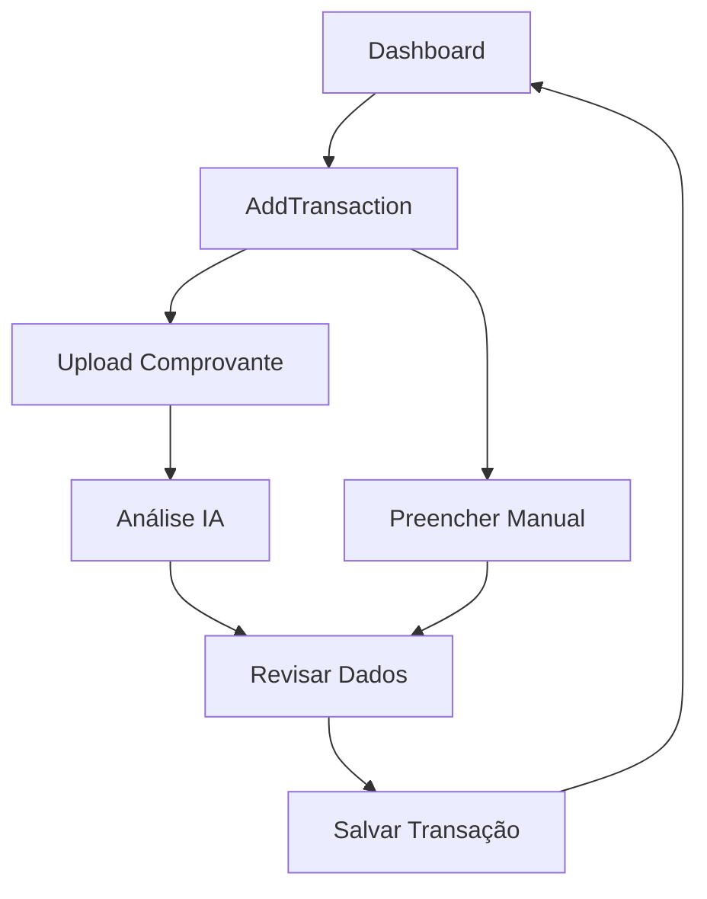

## 1. Product Overview

OincFin é um sistema de gerenciamento financeiro pessoal que permite aos usuários controlar suas despesas, categorizar gastos e gerenciar cartões de crédito. O produto resolve o problema de controle financeiro pessoal, ajudando usuários a entenderem para onde vai seu dinheiro e planejarem melhor suas finanças.

## 2. Core Features

### 2.1 User Roles

| Role           | Registration Method | Core Permissions                                              |
| -------------- | ------------------- | ------------------------------------------------------------- |
| Usuário Padrão | Email/Social Login  | Criar/visualizar transações, gerenciar cartões, ver dashboard |

### 2.2 Feature Module

Nosso sistema de gerenciamento financeiro consiste nas seguintes páginas principais:

1. **Dashboard**: Visão geral das finanças, estatísticas mensais, lista de transações recentes.
2. **Adicionar Transação**: Formulário para registrar novos gastos com leitura inteligente de comprovantes via IA.

### 2.3 Page Details

| Page Name      | Module Name             | Feature description                                                   |
| -------------- | ----------------------- | --------------------------------------------------------------------- |
| Dashboard      | Header                  | Exibir saudação personalizada e navegação por mês/ano.                |
| Dashboard      | Estatísticas            | Mostrar total do período, valor do cartão de crédito e última compra. |
| Dashboard      | Lista de Transações     | Exibir transações do mês selecionado com botão para adicionar nova.   |
| Dashboard      | Navegação Temporal      | Permitir navegação entre meses anteriores e futuros.                  |
| AddTransaction | Upload Inteligente      | Permitir upload de comprovante para análise via IA.                   |
| AddTransaction | Formulário Manual       | Formulário completo para cadastro manual de transações.               |
| AddTransaction | Gestão de Cartões       | Criar e selecionar cartões de crédito para parcelamento.              |
| AddTransaction | Parcelamento Automático | Criar múltiplas transações para parcelas de cartão.                   |

## 3. Core Process

### Fluxo do Usuário Principal

1. Usuário acessa o Dashboard e vê visão geral das finanças do mês atual
2. Pode navegar entre diferentes meses para ver histórico
3. Clica em "Nova Transação" para adicionar novo gasto
4. Escolhe entre upload de comprovante (IA analisa automaticamente) ou preenchimento manual
5. Seleciona cartão de crédito e define parcelas se necessário
6. Confirma dados e salva transação
7. Retorna ao Dashboard com lista atualizada

## 4. User Interface Design

### 4.1 Design Style

* **Cores Primárias**: Verde-esmeralda (#10b981) para elementos principais

* **Cores Secundárias**: Cinza neutro para backgrounds e textos

* **Botões**: Estilo arredondado com sombras suaves

* **Fontes**: Sistema padrão sans-serif, tamanhos variados para hierarquia

* **Layout**: Baseado em cards com bordas arredondadas e sombras sutis

* **Ícones**: Lucide React icons com estilo clean e minimalista

### 4.2 Page Design Overview

| Page Name      | Module Name         | UI Elements                                                              |
| -------------- | ------------------- | ------------------------------------------------------------------------ |
| Dashboard      | Header              | Título com nome do usuário, navegador de mês com botões laterais         |
| Dashboard      | Estatísticas        | Cards com ícones (Wallet, CreditCard, TrendingDown), valores em real     |
| Dashboard      | Lista de Transações | Cards brancos com borda, botão verde "Nova Transação"                    |
| AddTransaction | Upload              | Card com borda tracejada, ícone de scanner, botão de upload              |
| AddTransaction | Formulário          | Inputs com labels, selects para categorias e métodos de pagamento        |
| AddTransaction | Cartões             | Modal para adicionar novo cartão, select com lista de cartões existentes |

### 4.3 Responsiveness

* Desktop-first com adaptação mobile

* Sidebar fixa no desktop, bottom navigation no mobile

* Layout responsivo com grid e flexbox

* Touch-optimized para dispositivos móveis

