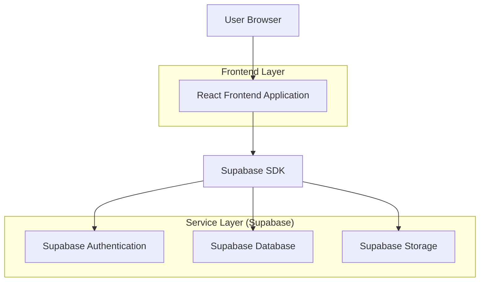
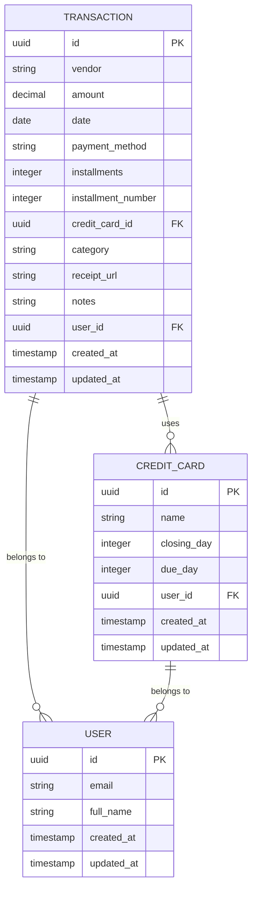

## 1. Architecture design



## 2. Technology Description
- Frontend: React@18 + tailwindcss@3 + vite
- Initialization Tool: vite-init
- Backend: Supabase (BaaS)
- Database: PostgreSQL (via Supabase)
- Storage: Supabase Storage (para comprovantes)
- Authentication: Supabase Auth

## 3. Route definitions
| Route | Purpose |
|-------|---------|
| / | Dashboard page, displays financial overview |
| /dashboard | Dashboard page, same as root |
| /add-transaction | Add new transaction with receipt upload |

## 4. API definitions

### 4.1 Supabase Database Operations

**Transaction Operations**
```javascript
// List transactions with filter
GET /rest/v1/transactions?date=gte.{start}&date=lte.{end}&order=-date&limit=100

// Create single transaction
POST /rest/v1/transactions
{
  vendor: string,
  amount: number,
  date: string,
  payment_method: string,
  installments: number,
  installment_number: number,
  credit_card_id: string,
  category: string,
  notes: string,
  receipt_url: string
}

// Bulk create transactions
POST /rest/v1/transactions (array)
```

**Credit Card Operations**
```javascript
// List credit cards
GET /rest/v1/credit_cards

// Create credit card
POST /rest/v1/credit_cards
{
  name: string,
  closing_day: number,
  due_day: number
}
```

### 4.2 Supabase Storage Operations
```javascript
// Upload receipt file
POST /storage/v1/object/receipts/{file_name}
Content-Type: multipart/form-data
```

## 5. Server architecture diagram
Não aplicável - Arquitetura serverless com Supabase

## 6. Data model

### 6.1 Data model definition


### 6.2 Data Definition Language

**Users Table (auth.users via Supabase Auth)**
```sql
-- Gerenciado automaticamente pelo Supabase Auth
```

**Transactions Table**
```sql
-- create table
CREATE TABLE transactions (
    id UUID PRIMARY KEY DEFAULT gen_random_uuid(),
    vendor VARCHAR(255) NOT NULL,
    amount DECIMAL(10,2) NOT NULL,
    date DATE NOT NULL,
    payment_method VARCHAR(50) NOT NULL CHECK (payment_method IN ('credit_card', 'debit_card', 'pix', 'cash', 'other')),
    installments INTEGER DEFAULT 1,
    installment_number INTEGER DEFAULT 1,
    credit_card_id UUID REFERENCES credit_cards(id),
    category VARCHAR(50) DEFAULT 'other' CHECK (category IN ('food', 'transport', 'shopping', 'services', 'entertainment', 'health', 'other')),
    receipt_url TEXT,
    notes TEXT,
    user_id UUID NOT NULL,
    created_at TIMESTAMP WITH TIME ZONE DEFAULT NOW(),
    updated_at TIMESTAMP WITH TIME ZONE DEFAULT NOW()
);

-- create indexes
CREATE INDEX idx_transactions_user_date ON transactions(user_id, date DESC);
CREATE INDEX idx_transactions_payment_method ON transactions(payment_method);
CREATE INDEX idx_transactions_category ON transactions(category);
CREATE INDEX idx_transactions_credit_card ON transactions(credit_card_id);
```

**Credit Cards Table**
```sql
-- create table
CREATE TABLE credit_cards (
    id UUID PRIMARY KEY DEFAULT gen_random_uuid(),
    name VARCHAR(100) NOT NULL,
    closing_day INTEGER NOT NULL CHECK (closing_day >= 1 AND closing_day <= 31),
    due_day INTEGER NOT NULL CHECK (due_day >= 1 AND due_day <= 31),
    user_id UUID NOT NULL,
    created_at TIMESTAMP WITH TIME ZONE DEFAULT NOW(),
    updated_at TIMESTAMP WITH TIME ZONE DEFAULT NOW()
);

-- create indexes
CREATE INDEX idx_credit_cards_user ON credit_cards(user_id);
```

### 6.3 Row Level Security (RLS) Policies
```sql
-- Enable RLS
ALTER TABLE transactions ENABLE ROW LEVEL SECURITY;
ALTER TABLE credit_cards ENABLE ROW LEVEL SECURITY;

-- Grant basic access
GRANT SELECT ON transactions TO anon;
GRANT SELECT ON credit_cards TO anon;
GRANT ALL PRIVILEGES ON transactions TO authenticated;
GRANT ALL PRIVILEGES ON credit_cards TO authenticated;

-- RLS Policies for transactions
CREATE POLICY "Users can view own transactions" ON transactions
    FOR SELECT USING (auth.uid() = user_id);

CREATE POLICY "Users can create own transactions" ON transactions
    FOR INSERT WITH CHECK (auth.uid() = user_id);

CREATE POLICY "Users can update own transactions" ON transactions
    FOR UPDATE USING (auth.uid() = user_id);

CREATE POLICY "Users can delete own transactions" ON transactions
    FOR DELETE USING (auth.uid() = user_id);

-- RLS Policies for credit cards
CREATE POLICY "Users can view own credit cards" ON credit_cards
    FOR SELECT USING (auth.uid() = user_id);

CREATE POLICY "Users can create own credit cards" ON credit_cards
    FOR INSERT WITH CHECK (auth.uid() = user_id);

CREATE POLICY "Users can update own credit cards" ON credit_cards
    FOR UPDATE USING (auth.uid() = user_id);

CREATE POLICY "Users can delete own credit cards" ON credit_cards
    FOR DELETE USING (auth.uid() = user_id);
```